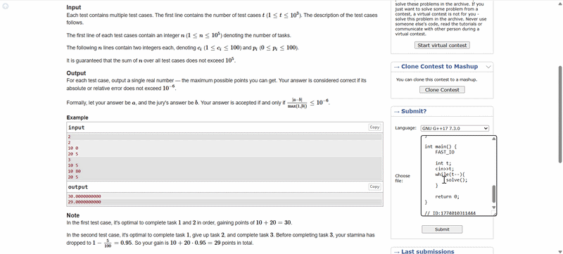

# Submity — Codeforces Submission Helper

Submity is a lightweight browser extension for Chromium and Firefox-based browsers that makes submitting solutions on Codeforces faster and more convenient.

## What it does

Submity adds a **Submit option directly beside each problem** on Codeforces.
This allows you to submit your solution **directly from the problem page**, without opening the separate *Submit* page and selecting the problem manually.

### ✨ New Features in this Fork (v2.0)

- **Live Verdict Tracker:** No need to refresh or visit the submissions page! Track your submission status (Testing, Accepted, Wrong Answer) live, directly beneath the submit button.

- **Stay on Page:** Submitting code no longer opens a new tab. A hidden iframe ensures you stay focused on the problem page while the code is processed securely in the background.

- **Clean UI:** Professional, distraction-free status updates with proper color coding and no unnecessary loading spinners.

- **Cross-Browser Support:** Now fully supports Firefox and Firefox-based browsers (like Zen Browser).

This small change helps make the workflow smoother and can save time during contests.

## Installation

### Chrome, Edge, and Brave (Chromium-based)

1. Download the extension from this repository and extract the ZIP file.
2. Open `chrome://extensions/` in your browser.
3. Enable **Developer Mode** (usually a toggle in the top right).
4. Click **Load Unpacked**.
5. Select the extracted extension folder.

### Firefox and Zen Browser (Gecko-based)

1. Download the extension from this repository and extract the ZIP file.
2. Open `about:debugging#/runtime/this-firefox` in your browser.
3. Click the **Load Temporary Add-on** button.
4. Select the `.zip` file.

*Note: The method above loads the extension temporarily for testing. To install it permanently without submitting it to Mozilla's Add-on store, you must use a developer-focused browser (like Zen or Firefox Developer Edition), navigate to `about:config`, set `xpinstall.signatures.required` to `false`, and install the `.zip` file via the gear icon in `about:addons`.*

## Feedback

If you try the extension, feel free to share your **feedback or suggestions**.
Improvements and ideas for additional features are welcome.
